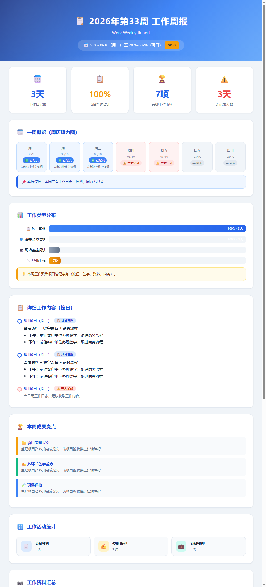

# 每周工作周报 Weekly Work Report 📊

一个**开箱即用的 Skill 模板**：让 AI 每周一自动读取你上周的工作日志，生成**美观直观的可视化 HTML 周报**——统计卡片、周历热力图、工作类型分布、成果亮点、趋势图表、下周计划，一页看全。

> 记录每一天，周报自动生成

---

## ✨ 特性

- 📊 **自动汇总**：读取一周工作日志，自动统计工作天数、类型分布
- 🗓️ **周历热力图**：每天状态一目了然（已记录 / 暂无 / 周末）
- 📈 **可视化图表**：纯 CSS 实现条形图、柱状图、热力图，无需外部库
- 🏆 **成果亮点**：高亮列出本周关键成果
- 💡 **下周计划**：基于上周进展自动建议本周重点
- 🎨 **现代设计**：渐变头部、卡片布局、响应式，浏览器直接查看
- ⚙️ **可接入自动化**：配置为每周一自动执行

## 🖼️ 效果预览

<p align="center">
  
</p>

> 示例为脱敏后的周报展示（[weekly-report-sample.html](examples/weekly-report-sample.html)），真实数据由你的工作日志自动填充。

## 📦 安装方法

### 方式一：直接把链接丢给 AI Agent（小白最推荐 🌟）

**什么都不用自己操作**，只需把下面这段话复制给你的 AI 助手（WorkBuddy / Codex / Claude 等），让它自己去下载、安装，再教你怎么用：

> 请帮我把这个 GitHub 仓库的 Skill 安装好：
> 仓库：https://github.com/fang-123559/weekly-work-report
> 请先下载（git clone 或下载 ZIP），把 `weekly-work-report` 文件夹放到我的 skills 目录
> （WorkBuddy: `~/.workbuddy/skills/`，Codex: `~/.codex/skills/`，Claude: `~/.claude/skills/`），
> 确认 `SKILL.md` 在文件夹根目录，然后告诉我怎么用它。

### 方式二：手动下载（推荐新手）

1. 点击右上角 **Code → Download ZIP** 下载并解压
2. 将解压后的文件夹放入你的 Skill 目录：
   - **WorkBuddy**：`~/.workbuddy/skills/`
   - **Codex**：`~/.codex/skills/`
   - **Claude**：`~/.claude/skills/`
   - 其他支持 Agent Skills 的平台：放入对应 skills 目录
3. 确保文件夹名为 `weekly-work-report`，且 `SKILL.md` 在文件夹根目录

### 方式三：Git 克隆

```bash
git clone https://github.com/fang-123559/weekly-work-report.git
# 然后将整个文件夹复制到 skills 目录
```

## 🚀 使用方式

### 方式一：对话中直接触发

> "生成上周工作周报"、"帮我做一份周报"

### 方式二：接入自动化定时推送（推荐）

在 WorkBuddy / Codex / Claude 等平台创建一个**每周一上午**的定时任务，prompt 可参考 [prompts/automation-prompt.md](prompts/automation-prompt.md)。

首次使用请将模板 `templates/weekly-report-template.html` 作为生成基础，并确保工作日志目录存在。

## 🗂️ 项目结构

```
weekly-work-report/
├── SKILL.md                      # Skill 核心定义（执行流程 + 异常处理 + 反例）
├── README.md                     # 本文件
├── LICENSE                       # MIT 许可证
├── prompts/
│   └── automation-prompt.md      # 自动化定时任务的 prompt 模板
├── templates/
│   └── weekly-report-template.html  # 周报 HTML 模板（占位符版）
└── examples/
    └── weekly-report-sample.html # 脱敏示例周报
```

## ⚙️ 自定义

- **改配色**：修改模板中 CSS 变量 `--primary` / `--gradient-start` 等
- **改周报结构**：增删模板中的卡片区块（统计/热力图/图表等）
- **改触发场景**：修改 SKILL.md frontmatter 中的 `description` 触发词

## 📜 License

[MIT](LICENSE) © fang-123559

---

<p align="center"><b>记录每一天 · 周报自动生成</b> 📊</p>
